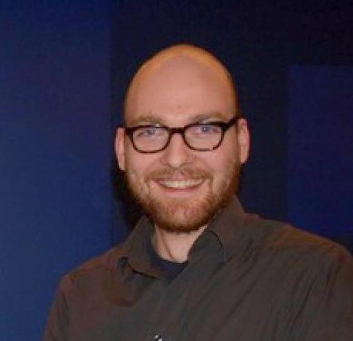
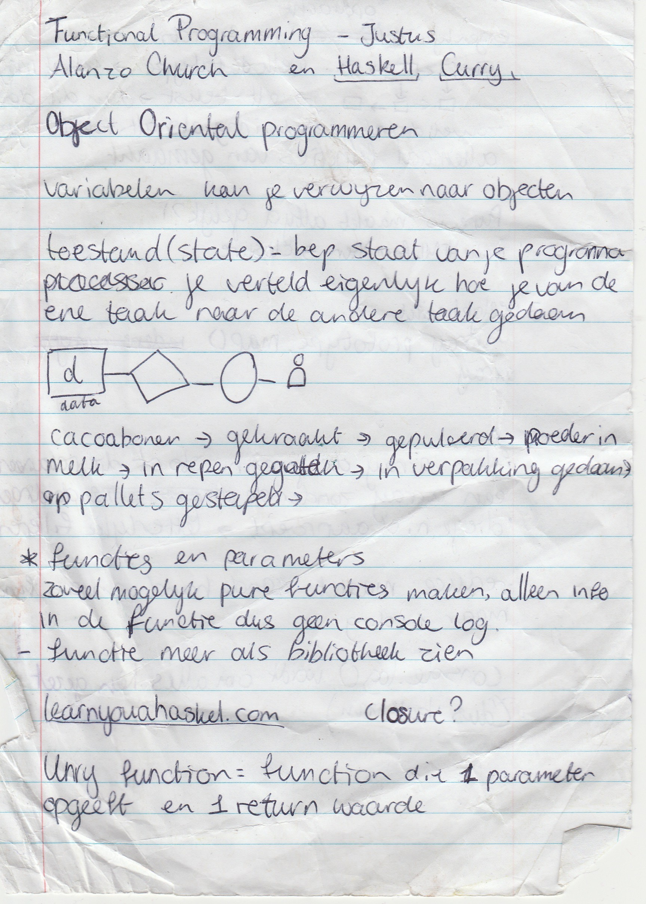
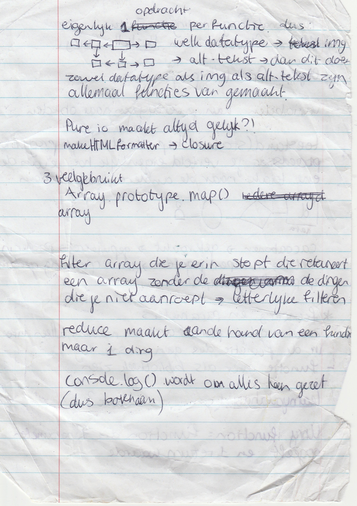
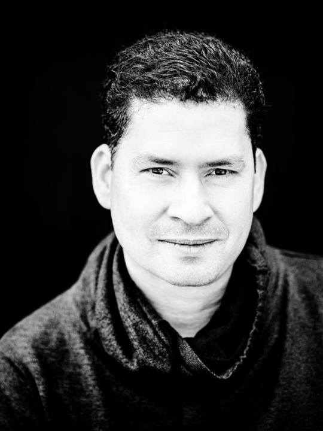
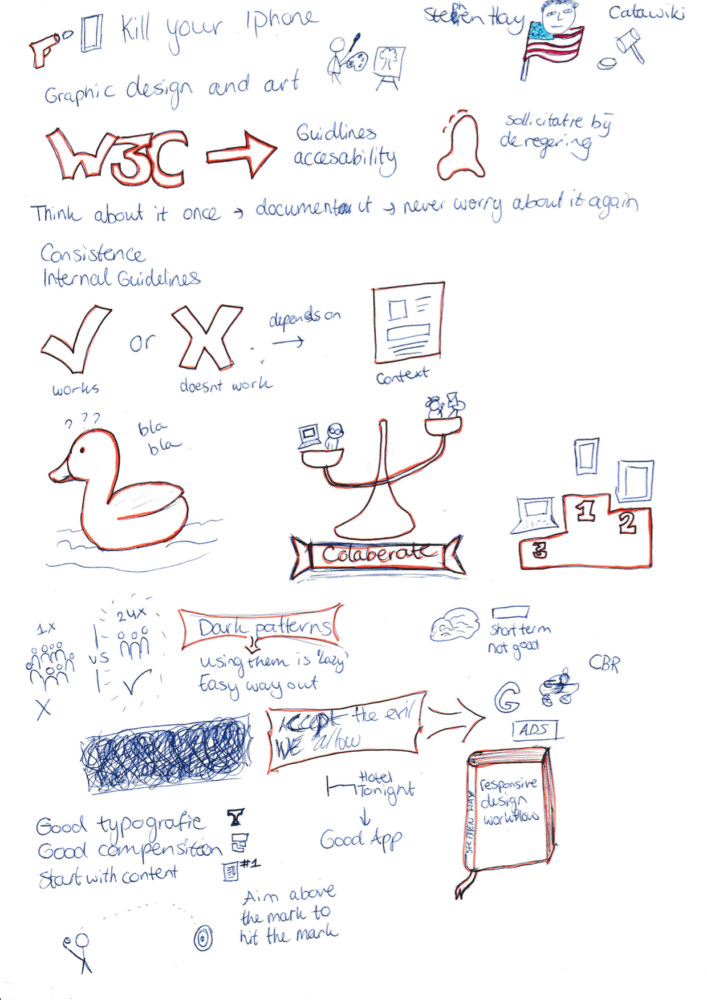

# weekly-nerd

 ### Justus Sturkenboom - Functional Programming

De eerste Weekly Nerd werd afgetrapt door Justus Sturkenboom die ons wat meer ging vertellen over Functional Programming.

Justus Sturkenboom is een docent en teamcoördinator bij de opleiding Communicatie en Multimedia Design van de Hogeschool van Amsterdam. Hij heeft Wijsbegeerte geleerd aan de Universiteit van Amsterdam. Sinds 1999 is hij webdeveloper geweest bij diverse bedrijven en is zijn kennis gaan delen met leergierige studenten. Justus geeft aan dat de reden dat hij het onderwijs in gegaan is, is om zijn kennis over te dragen (Gastredacteur, 2013).

> “Een goede docent heeft kennis van zijn vakgebied en de capaciteiten om dat op een gepassioneerde manier over te brengen.“

Tijdens dit college heeft hij verteld dat je variabelen kan verwijzen naar objecten. Hij heeft het gehad over states, functies, parameters en filters.
Hij vertaalde het verhaal van data in cacaobonen:
De cacaobonen worden geplukt, dan worden ze gekraakt, gepulverd, poeder wordt in melk verwerkt, in mallen gegoten om repen te maken, in verpakking gedaan en op pallets gestapeld.
Dit doen wij ook met de data. Deze halen we ergens vandaan, zorgen dat we de data blootleggen die wij nodig hebben, vormen het op de manier dat wij het willen presenteren en zorgen dat dit mooi verpakt wordt en de gebruiker wordt voorgeschoteld.

Dit was een hele duidelijke vergelijking die aantoont wat wij met data willen bereiken.

Justus hamerde op het maken van pure functies, dat wilt zeggen dat je functies schoon houdt en bijvoorbeeld geen gebruik maakt van console logs in je functies. Daarnaast vertelde hij over de Unary function, een functie die 1 parameter opgeeft en 1 return waarde. Je wilt ook eigenlijk alleen gebruik maken van één opdracht per functie.

Bron: Gastredacteur (10 april 2013). Op basis van stemmen kun je geen beste docent kiezen. Gevonden op de Folia website: http://www.folia.nl/actueel/40433/op-basis-van-stemmen-kun-je-geen-beste-docent-kiezen

<b>Stephen Hay</b>

Onze volgende gast was Stephen Hay. Hij had geen presentatie voorbereidt, in plaats daarvan konden we hem vragen stellen over zijn beroepsrol.

Stephen Hay is van origine een Amerikaan. Hij is in 1992 naar Nederland gekomen voor zijn vrouw en is blijven plakken. Zijn professionele herkomst is grafisch ontwerpen. Sindsdien is hij heel erg gegroeid en is hij een populaire spreker onder de onderwerpen: CSS, web toegankelijkheid en open web standaarden.

Het gesprek ging over verschillende dingen. We hebben gevraagd hoe hij in Nederland terecht was gekomen en wat hij hier deed. Hij is door zijn vrouw geïmmigreerd naar Nederland en werkt voor Catawiki als hoofd van de User Experience. Hij is niet van mening dat het altijd ‘Mobile first’ moet zijn. Het is wel zeker een apparaat om rekening mee te houden, aangezien het inmiddels wel een apparaat is wat het meest gebruikt wordt. Waar hij ook naar leeft is:

> “Aim above the mark to hit the mark”

