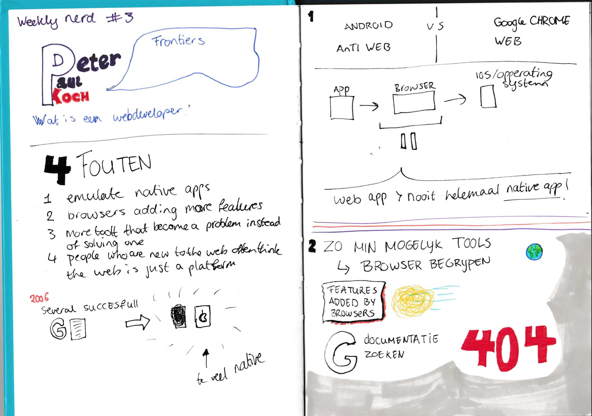
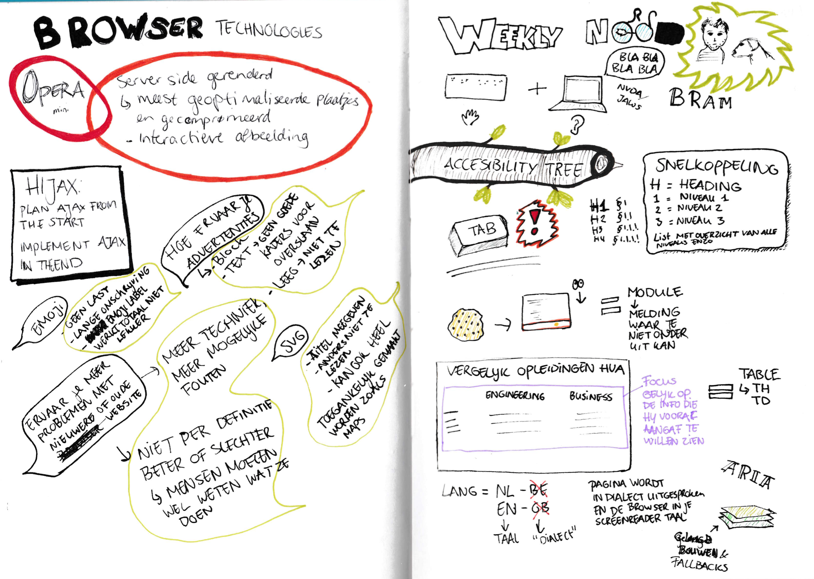
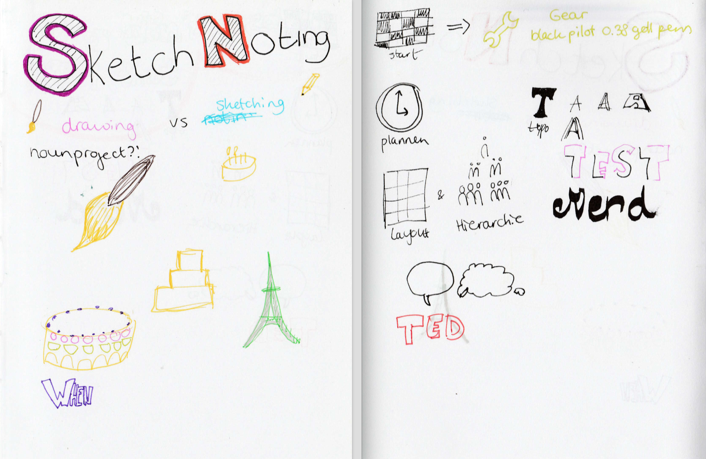
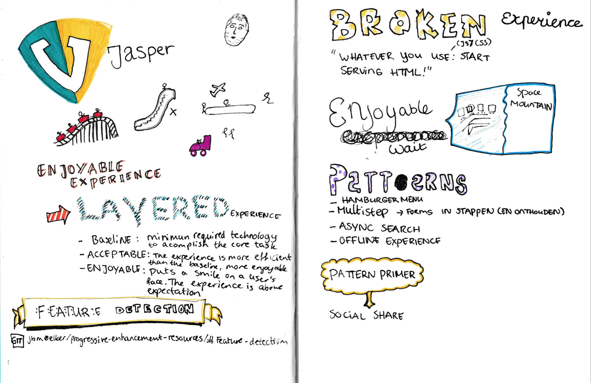
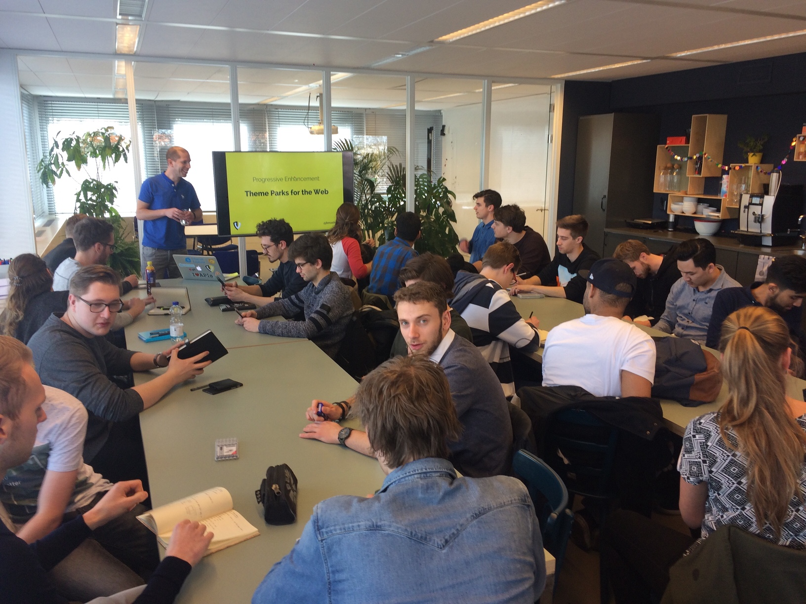
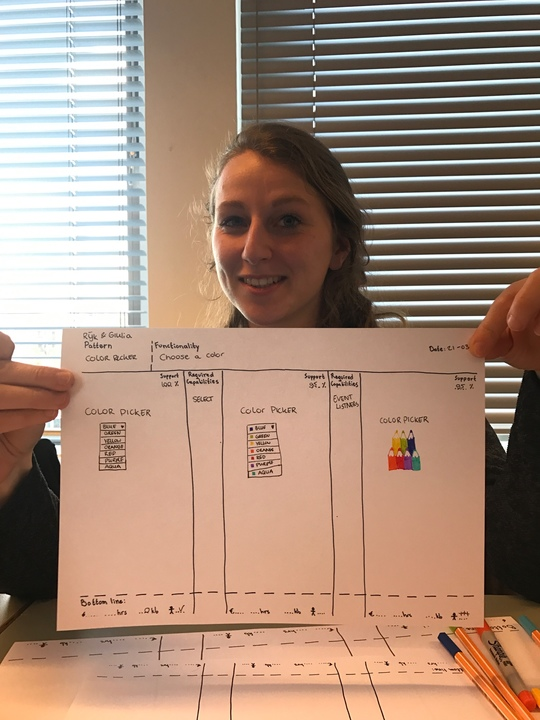
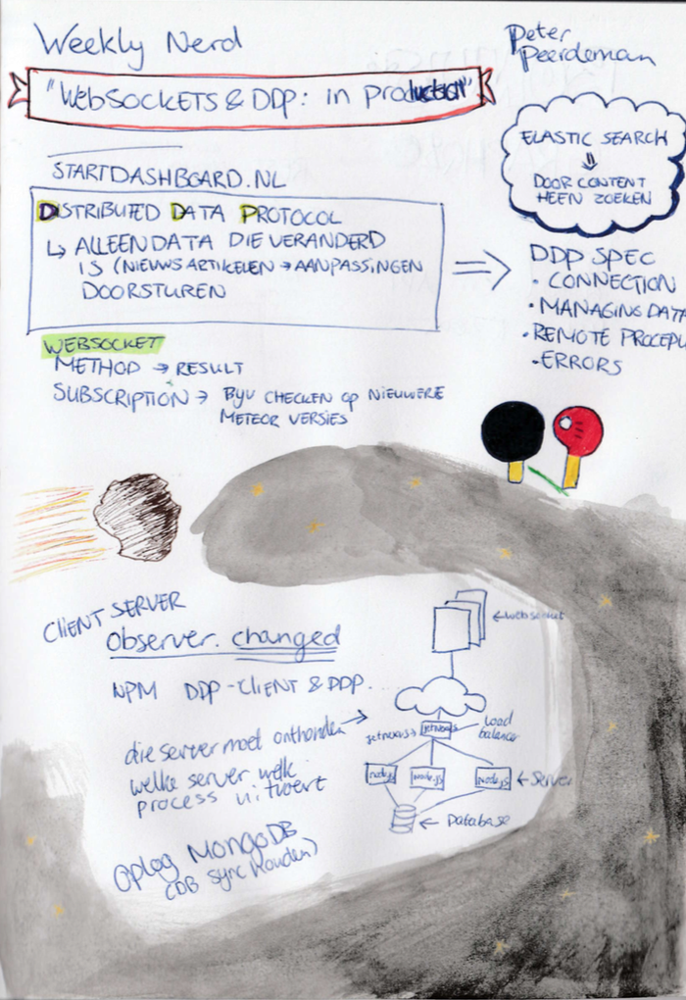
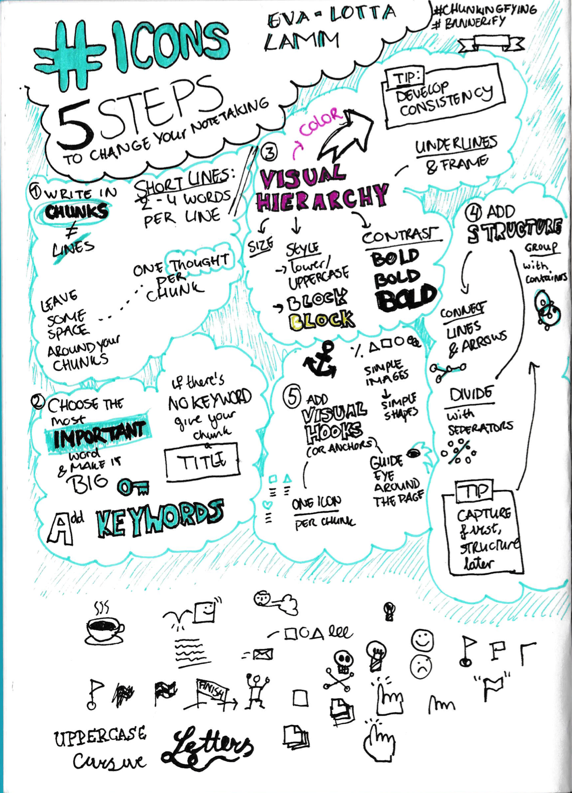
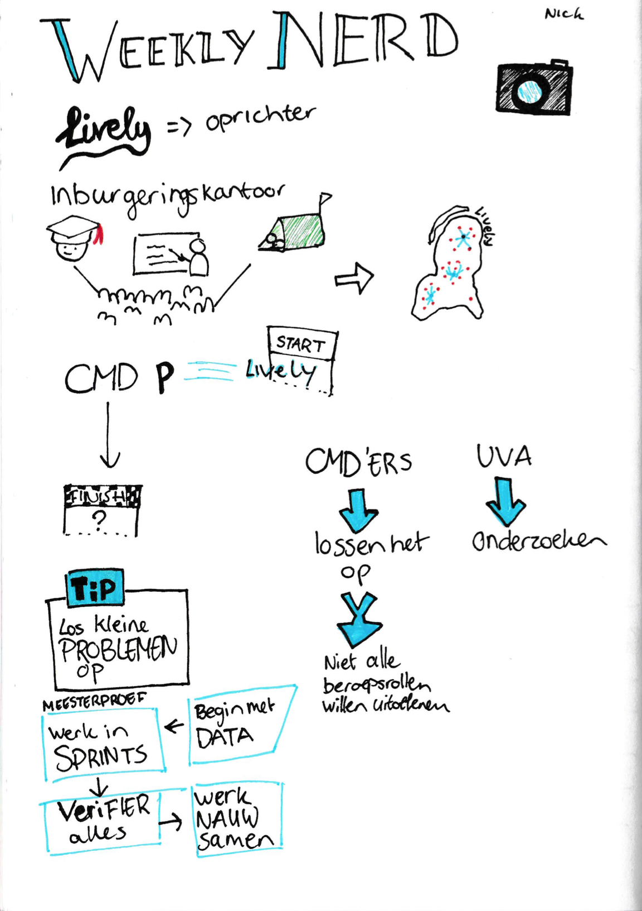

# Weekly Nerd

Every week at the minor Web Development, we had a professional in front of our class. Here is a list of all of these guest speakers. Besides the speakers we also had 5 articles to write, these are displayed beneath them.

------------------------

## Weekly Nerds

<b>Justus Sturkenboom - Functional Programming</b>

De eerste Weekly Nerd werd afgetrapt door Justus Sturkenboom die ons wat meer ging vertellen over Functional Programming.

Justus Sturkenboom is een docent en teamcoördinator bij de opleiding Communicatie en Multimedia Design van de Hogeschool van Amsterdam. Hij heeft Wijsbegeerte geleerd aan de Universiteit van Amsterdam. Sinds 1999 is hij webdeveloper geweest bij diverse bedrijven en is zijn kennis gaan delen met leergierige studenten. Justus geeft aan dat de reden dat hij het onderwijs in gegaan is, is om zijn kennis over te dragen (Gastredacteur, 2013).

> “Een goede docent heeft kennis van zijn vakgebied en de capaciteiten om dat op een gepassioneerde manier over te brengen.“

Tijdens dit college heeft hij verteld dat je variabelen kan verwijzen naar objecten. Hij heeft het gehad over states, functies, parameters en filters.
Hij vertaalde het verhaal van data in cacaobonen:
De cacaobonen worden geplukt, dan worden ze gekraakt, gepulverd, poeder wordt in melk verwerkt, in mallen gegoten om repen te maken, in verpakking gedaan en op pallets gestapeld.
Dit doen wij ook met de data. Deze halen we ergens vandaan, zorgen dat we de data blootleggen die wij nodig hebben, vormen het op de manier dat wij het willen presenteren en zorgen dat dit mooi verpakt wordt en de gebruiker wordt voorgeschoteld.

Dit was een hele duidelijke vergelijking die aantoont wat wij met data willen bereiken.

Justus hamerde op het maken van pure functies, dat wilt zeggen dat je functies schoon houdt en bijvoorbeeld geen gebruik maakt van console logs in je functies. Daarnaast vertelde hij over de Unary function, een functie die 1 parameter opgeeft en 1 return waarde. Je wilt ook eigenlijk alleen gebruik maken van één opdracht per functie.

Bron: Gastredacteur (10 april 2013). Op basis van stemmen kun je geen beste docent kiezen. Gevonden op de Folia website: http://www.folia.nl/actueel/40433/op-basis-van-stemmen-kun-je-geen-beste-docent-kiezen

<b>Stephen Hay</b>

Onze volgende gast was Stephen Hay. Hij had geen presentatie voorbereidt, in plaats daarvan konden we hem vragen stellen over zijn beroepsrol.

Stephen Hay is van origine een Amerikaan. Hij is in 1992 naar Nederland gekomen voor zijn vrouw en is blijven plakken. Zijn professionele herkomst is grafisch ontwerpen. Sindsdien is hij heel erg gegroeid en is hij een populaire spreker onder de onderwerpen: CSS, web toegankelijkheid en open web standaarden.

Het gesprek ging over verschillende dingen. We hebben gevraagd hoe hij in Nederland terecht was gekomen en wat hij hier deed. Hij is door zijn vrouw geïmmigreerd naar Nederland en werkt voor Catawiki als hoofd van de User Experience. Hij is niet van mening dat het altijd ‘Mobile first’ moet zijn. Het is wel zeker een apparaat om rekening mee te houden, aangezien het inmiddels wel een apparaat is wat het meest gebruikt wordt. Waar hij ook naar leeft is:

> “Aim above the mark to hit the mark”

<b>Peter Paul Koch - Browser bloat</b>

Peter Paul Koch discussed the following subjects when he came to speak to us:

4 commen mistakes
- Understanding the web -> minify the use of tools
- Libraries
- True JavaScript
- Web Platforms

<b>Titus Wormer - Advanced Git Tips & Tricks</b>

In this Weekly Nerd Titus Wormer told us more about the tool we used throughout the minor, Git. He spoke about:

- Git vs GitHub
- Licenses and copyright
- History of Git
- Explained some terms

<b>Bram Duvigneau - Accessibility</b>

Bram Duvigneau is a blind developer and he spoke to us about accessibility. He spoke about the following subjects:

Special keyboard
- Tab key
- Shortcuts
- Cookies
- Languages
- Aria

<b>Justus Sturkenboom - Sketchnoting</b>

Justus Sturkenboom gave a class about Sketchnoting and he spoke about the following:

- Drawing vs sketching
- Developing a sketch dictionary
- Practice, practice, practice
- Start with simple sketches
- Gear

<b>Jasper Moelker - Theme Parks for the Web</b>

This Weekly Nerd we Went to the company de Voorhoede. We teamed op to do an exercise for progressive enhancement. Besides that they spoke about:

- Enjoyable experience
- Layered experience
- Feature detection
- Broken experience
- Patterns

<b>Peter Peerdeman - RTW en GraphQL</b>

Peter Peerdeman is one of the owners of the company Lifely. He came to speak about Web of Things and GraphQL. Subjects that came up:

- Websockets
- Distributed Data Protocol
- Meteor
- GraphQL

<b>Niels Leenheer - Obscure Browsers</b>

Niels Leenheer showed us his own Internet of Things creations. He told us about how he got these ideas and how he made them.

- HTML5Check
- Monsters and Mailboxes
- House of the future
- IOT-it-yourself
- Pixel monster

<b>Eva-Lotta Lamm - Sketchnotes</b>

This Weekly Nerd we went to an Icons meeting. The speaker was Eva-Lotta Lamm and she spoke about sketch noting:

- Chunks
- Importancy
- Visual Hierarchy
- Structure
- Visual Hooks

<b>Nick de Bruijn - a company made by CMD students</b>

An other owner of Lifely came to speak about his school and work experience.

- Work experience world wide
- Jobs lifely recieved
- His school experience
- Differences between HBO and University students
- Tips for starting a company

------------------------

## Articles
